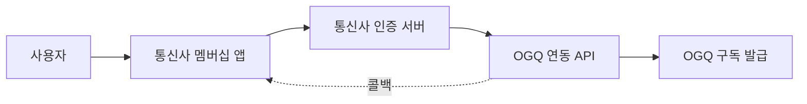

# 설계

## 개요

통신사 멤버십 혜택을 통해 OGQ 구독권을 지급/연동하기 위한 시스템 설계 문서입니다.
[문서 홈](index.html)에서 전체 목차를 확인할 수 있습니다.

## 전체 흐름

```
사용자 → 통신사 멤버십 앱 → 통신사 인증 서버 → OGQ 연동 API → OGQ 구독 발급
```



1. 사용자가 통신사 멤버십 앱에서 "OGQ 구독 받기"를 클릭합니다.
2. 통신사 인증 서버가 사용자 식별 토큰을 발급합니다.
3. OGQ 연동 API가 토큰을 검증하고 구독을 발급합니다.
4. 발급 결과를 통신사 앱으로 콜백합니다.

> [!NOTE]
> 위 다이어그램의 콜백 경로는 비동기로 처리되며, 재시도 정책은 아직 확정되지 않았습니다.

> [!WARNING]
> 인증 토큰의 유효 기간이 만료된 상태로 API를 호출하면 401 오류가 발생합니다. 반드시 토큰 갱신 로직을 함께 구현하세요.

## 컴포넌트 구성

| 컴포넌트 | 역할 | 담당 |
| --- | --- | --- |
| 통신사 인증 서버 | 사용자 식별 및 토큰 발급 | 통신사 |
| OGQ 연동 API | 토큰 검증 및 구독 발급 | OGQ |
| 구독 관리 DB | 구독 상태 저장 | OGQ |
| 콜백 핸들러 | 결과 통지 | OGQ |

## API 명세 (초안)

```json
{
  "method": "POST",
  "path": "/v1/partner/subscribe",
  "body": {
    "partnerToken": "string",
    "userId": "string",
    "planCode": "string"
  }
}
```

## 처리 체크리스트

- [x] 인증 토큰 검증 로직 정의
- [x] 구독 발급 API 설계
- [ ] 콜백 재시도 정책 확정
- [ ] 장애 시 롤백 절차 문서화

## 관련 문서

- 연동 방식 후보는 [후보 비교](02_candidates.html)를 참고하세요.
- 최종 채택 방식은 [결정 게이트](03_decision_gate.html)에서 확인할 수 있습니다.
