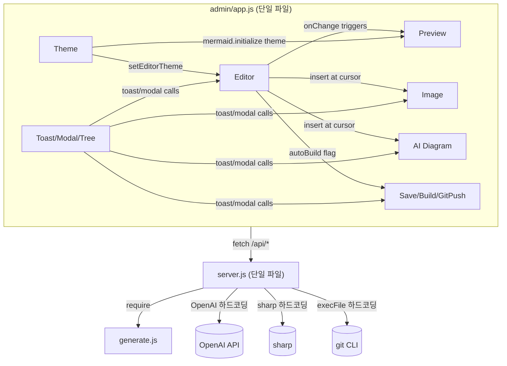
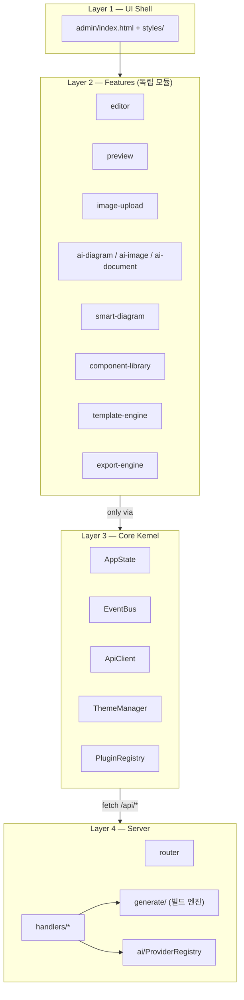
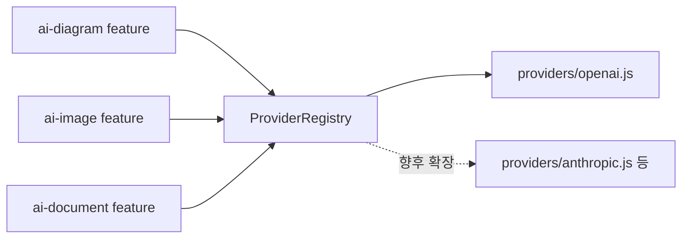

# Docs Builder v1.1 Architecture & Roadmap

> 이 문서는 코드 변경 없이 **현재 상태 분석 + 앞으로의 구조 제안**만을 담은 계획서입니다.
> v1.1의 첫 작업은 새 기능 추가가 아니라, **기능을 더해도 서로 영향을 주지 않는 구조**를 만드는 것입니다.

---

## 1. 현재 프로젝트 폴더 구조 분석

### 1.1 전체 구조

```
docs-builder-v1.1/
├── admin/                    # 브라우저 편집 UI (프론트엔드 전체)
│   ├── index.html            # 345줄 - 3단 레이아웃 + 6개 모달 전부 포함
│   ├── app.js                # 1,413줄 - 모든 프론트엔드 로직 (단일 IIFE)
│   └── styles.css            # 1,511줄 - 전체 스타일
│
├── assets/                   # 빌드된 정적 사이트가 사용하는 자산
│   ├── main.js                # 361줄 - 정적 사이트 클라이언트 스크립트
│   ├── style.css              # 932줄
│   └── images/                # 사이트 임베드용 샘플 이미지
│
├── docs/                     # Markdown 원본 문서 (콘텐츠, 코드 아님)
│   └── images/
│
├── dist/                     # 빌드 산출물 (git 비추적)
│
├── server.js                 # 916줄 - 로컬 API 서버 (라우팅+비즈니스 로직 전부)
├── generate.js                # 538줄 - 정적 사이트 빌더 (markdown-it 커스터마이징)
├── package.json
└── .github/workflows/deploy.yml
```

### 1.2 핵심 관찰

- **파일 수 대비 책임이 과밀**: 전체 프론트엔드 로직(에디터, 프리뷰, 이미지, AI 다이어그램, 문서 트리, 모달, 설정, 단축키, Git push, 빌드 트리거)이 **`admin/app.js` 단 하나**에 들어있습니다. `admin/index.html`도 6개 모달 마크업이 한 파일에 나열되어 있습니다.
- **서버도 동일 패턴**: `server.js`가 정적 파일 서빙, 문서 CRUD, 이미지 업로드+최적화, AI 다이어그램 호출, Git 명령 실행, 빌드 트리거, 서버 종료까지 **라우팅과 비즈니스 로직을 한 파일에서 처리**합니다.
- **`generate.js`는 상대적으로 응집도가 높음**: markdown-it 렌더링 규칙(콜아웃, 이미지 figure, Mermaid, TOC)이 한 파일에 몰려있지만 "정적 사이트 빌드"라는 단일 책임에 집중되어 있어 다른 파일보다는 낫습니다.
- **모듈 시스템 부재**: `admin/app.js`는 ES 모듈이나 번들러 없이 `(function(){...})()` IIFE + DOM 전역 조회 방식입니다. 함수 간 경계는 있지만 파일 경계가 없어 "모듈"이라 부르기 어렵습니다.
- **빌드 도구 없음**: 프론트엔드는 CDN(Monaco, Mermaid)에 직접 의존하며 번들러/트랜스파일러가 없습니다. 이는 장점(구성 단순함)이자 v1.1에서 모듈 분리 시 제약(ESM `import`를 쓰려면 `<script type="module">` 또는 최소한의 번들 전략이 필요)이기도 합니다.

---

## 2. 기능별 의존성 분석

각 기능이 실제로 코드베이스 어디에 어떻게 흩어져 있는지 정리합니다.

### 2.1 Editor

| 위치 | 내용 |
| --- | --- |
| `admin/app.js:193-289` | Monaco 초기화, textarea 폴백, 값 get/set, 테마/폰트 적용 |
| `admin/app.js:293-428` | Markdown 툴바 액션 (H1/H2/Bold/Quote/Table/Codeblock/Mermaid) — Monaco용/폴백용 두 벌 구현 |
| `admin/app.js:662-699` | dirty flag, autosave 타이머, 프리뷰 스케줄링 — **Editor가 Preview/Save를 직접 호출** |
| `admin/index.html:60-108` | 에디터 pane 마크업 + 툴바 버튼 |
| `server.js` (`/api/docs/:filename` GET/POST) | 문서 원문 로드/저장 |

**의존 대상**: Preview(변경 시 트리거), Image(삽입 대상), AI Diagram(삽입 대상), 저장 API.

### 2.2 Preview

| 위치 | 내용 |
| --- | --- |
| `admin/app.js:696-766` | `schedulePreview`, `renderPreview`, `runMermaid`, front matter 스트리핑 |
| `admin/app.js:771-801` | 이미지 라이트박스 (프리뷰 내 이미지 클릭) |
| `generate.js:17-180` | markdown-it 인스턴스 + 커스텀 렌더 규칙(체크박스, mermaid fence, figure, callout, heading anchor) — **`/api/preview`와 정적 빌드가 이 로직을 공유** |
| `server.js:463-493` | `/api/preview` — `generate.js`의 `renderMarkdownPreview` 호출 |

**의존 대상**: Editor(입력 소스), `generate.js`(렌더링 엔진 공유 — 이는 바람직한 설계), Mermaid CDN.

### 2.3 Export (빌드/배포)

| 위치 | 내용 |
| --- | --- |
| `generate.js:479-527` | `build()` — dist 재생성, HTML 페이지 렌더, 검색 인덱스/사이드바 JSON 생성 |
| `server.js:814-824` | `/api/build` — require 캐시 삭제 후 `generate.js` 호출 |
| `server.js:508-551` | `/api/git-push` — `git add/commit/push`를 직접 `execFile`로 실행 |
| `.github/workflows/deploy.yml` | main push 시 `npm run build` → GitHub Pages 배포 |

**의존 대상**: `generate.js`(빌드 엔진), Editor(자동 빌드 옵션이 저장 흐름에 결합 — `admin/app.js:987-989`).

### 2.4 AI Diagram

| 위치 | 내용 |
| --- | --- |
| `admin/app.js:476-510` | `generateAiDiagram` — 선택 텍스트 확인, API 호출, Mermaid 코드로 치환 |
| `server.js:710-812` | 시스템 프롬프트, OpenAI 호출, 응답에서 코드 추출 — **OpenAI 전용, 하드코딩** |
| `admin/app.js:37,99-101,1384` | 버튼 DOM 참조 및 바인딩 |

**의존 대상**: Editor(선택 영역 읽기/치환), OpenAI API(서버가 직접 결합 — provider 교체 시 `server.js` 수정 필요).

### 2.5 Image

| 위치 | 내용 |
| --- | --- |
| `admin/app.js:433-654` | 업로드 타입 검증, dataURL 변환, 순차 업로드, 붙여넣기/드래그앤드롭 이벤트 바인딩 — Monaco의 hidden textarea와 capture 단계 이벤트가 얽혀 있음 |
| `server.js:553-708` | mimetype→ext 매핑, sharp 기반 리사이즈/재인코딩, 파일명 생성(`docSlug` 기반), `/api/images` 핸들러 |

**의존 대상**: Editor(커서 삽입 대상), `docSlug`를 위해 `state.currentFilename`(Editor 상태) 참조.

### 2.6 Components (UI 구성요소: 모달, 토스트, 트리, 툴바)

| 위치 | 내용 |
| --- | --- |
| `admin/app.js:108-145` | Toast 헬퍼 |
| `admin/app.js:806-939` | 문서 트리/최근 목록/검색 필터 렌더링 |
| `admin/app.js:1260-1287` | 모달 open/close 공통 헬퍼 (data-close 속성 기반) |
| `admin/index.html` 전체 | New Doc / Import AI / Settings / Shutdown / Git Push 모달 마크업이 한 파일에 나열 |

**의존 대상**: 거의 모든 기능이 Toast/Modal을 호출 — 사실상 프론트엔드 전역 유틸리티 역할을 하지만 별도 모듈로 분리되어 있지 않음.

### 2.7 Theme

| 위치 | 내용 |
| --- | --- |
| `admin/app.js:178-188` | `applyTheme`/`toggleTheme` — `document.body[data-theme]` + localStorage |
| `admin/app.js:271-275,742-746` | Editor(Monaco)와 Mermaid 각각에 테마를 개별적으로 재적용해야 함 |
| `assets/main.js:44-58` | 정적 사이트 쪽은 `prefers-color-scheme` 기반 별도 구현 (admin과 로직이 다름 — **관리자 페이지 테마와 정적 사이트 테마가 서로 다른 메커니즘**) |

**의존 대상**: Editor, Preview(Mermaid), 정적 사이트(별도 구현이라 사실상 미의존이지만 일관성 문제 존재).

### 2.8 의존성 요약 다이어그램



---

## 3. 서로 강하게 연결되어 있는 부분 (Tight Coupling)

우선순위 높은 순으로 정리합니다. "강한 결합"은 단순히 함수가 서로를 호출하는 것이 아니라, **한 쪽을 바꾸면 다른 쪽이 깨지거나, 파일을 전체를 이해해야만 안전하게 수정할 수 있는 경우**를 뜻합니다.

### 3.1 Editor ↔ 거의 모든 기능 (최우선 문제)

`state.monacoReady` / `state.fallbackEditor`라는 두 가지 에디터 백엔드 분기가 Image 업로드(`insertTextAtCursor`), AI Diagram(`getSelectedEditorText`, `replaceSelectionWithMermaid`), 툴바 액션(`applyMarkdownAction`) 등 **거의 모든 기능 안에 `if (state.monacoReady) ... else if (state.fallbackEditor) ...` 형태로 중복**되어 있습니다. Editor의 내부 구현(Monaco vs textarea)이 바뀌면 4~5곳을 동시에 고쳐야 합니다.

→ **문제**: Editor가 "인터페이스"가 아니라 "구현 세부사항"으로 노출되어 있음.

### 3.2 Preview 렌더링 로직의 이중 존재

`generate.js`의 markdown-it 설정(콜아웃, figure, mermaid fence, heading anchor)은 정적 빌드와 `/api/preview` 양쪽에서 재사용되므로 이 부분 자체는 잘 설계되어 있습니다. 그러나 **prefix front matter 스트리핑은 클라이언트(`admin/app.js:704-711`)에서, mermaid 렌더링 재시도 로직은 admin(`app.js`)과 정적 사이트(`assets/main.js`)에 각각 따로** 구현되어 있어 두 곳을 항상 동기화해야 합니다.

### 3.3 Image 업로드 ↔ Editor 상태(`currentFilename`)

`uploadImageFile`이 `docSlug`를 얻기 위해 `state.currentFilename`을 직접 참조합니다(`admin/app.js:523-525`). Image 모듈이 Editor의 내부 상태 변수에 직접 의존하는 구조라, "이미지를 문서와 무관하게 업로드"하는 미래 기능(예: 공용 이미지 라이브러리)을 추가하려면 이 결합을 먼저 풀어야 합니다.

### 3.4 AI Diagram이 OpenAI에 하드 결합

`server.js`의 `callOpenAiForDiagram`이 OpenAI 엔드포인트/모델/프롬프트를 코드에 직접 박아 넣고 있습니다(`server.js:736-765`). 예상 기능 목록에 있는 **AI Image, AI Document**를 추가하려면 각각 별도의 provider 호출 함수를 또 만들게 되어, "AI 기능"이라는 개념이 provider별로 흩어지게 됩니다.

### 3.5 서버 라우팅과 비즈니스 로직의 미분리

`server.js`는 HTTP 라우팅(`if (pathname === ... && req.method === ...)`)과 실제 처리 로직(이미지 리사이즈, git 실행, AI 호출)이 같은 파일, 같은 함수 안에 있습니다. 새 API 엔드포인트(Component Library, Template Engine 등)를 추가할 때마다 916줄짜리 파일에 계속 append하게 되는 구조입니다.

### 3.6 Theme의 이중 구현

Admin(`app.js`, localStorage + 수동 토글)과 정적 사이트(`assets/main.js`, `prefers-color-scheme` 자동 감지)가 **서로 다른 테마 메커니즘**을 사용합니다. 지금은 독립적이라 충돌은 없지만, 향후 "빌드된 사이트에도 수동 다크모드 토글 추가" 같은 요구가 오면 두 시스템을 하나로 합치는 리팩터링이 필요해집니다.

### 3.7 모달 마크업의 정적 나열

`admin/index.html`에 6개 모달(New Doc, Import AI, Settings, Shutdown, Git Push, + Lightbox)이 전부 하드코딩되어 있고, `app.js`가 각 모달의 DOM ID를 직접 `getElementById`로 참조합니다. 새 기능(Template Engine, Component Library)마다 모달이 필요하다면 `index.html`이 계속 길어지고 `el` 객체(`app.js:7-75`)도 계속 늘어나는 구조입니다.

---

## 4. 기능을 독립 모듈로 분리할 수 있는 부분

기존 동작을 유지한 채(리팩터링 시점 기준) 아래와 같이 나눌 수 있습니다. 이 섹션은 **제안**이며 지금 코드를 수정하지는 않습니다.

### 4.1 프론트엔드 (`admin/`)

| 신규 모듈 | 현재 위치에서 이전할 내용 | 노출할 인터페이스 |
| --- | --- | --- |
| `editor/EditorAdapter` | Monaco/fallback 분기 전체 | `getValue()`, `setValue()`, `insertAtCursor()`, `getSelection()`, `onChange()`, `setTheme()`, `focus()` — Monaco/textarea 차이를 완전히 은닉 |
| `editor/MarkdownToolbar` | 툴바 액션 매핑 + 적용 로직 | `applyAction(name)` — `EditorAdapter`에만 의존 |
| `preview/PreviewRenderer` | `renderPreview`, `runMermaid`, front matter 스트립 | `render(markdown)` |
| `features/ImageUpload` | 업로드/붙여넣기/드래그앤드롭 | `attach(editorAdapter, contextProvider)` — `contextProvider`가 `docSlug`를 공급(직접 `state` 참조 제거) |
| `features/AiDiagram` | AI 다이어그램 버튼 로직 | `generate(selectedText): Promise<mermaidCode>` |
| `ui/Toast`, `ui/Modal` | 토스트/모달 공통 헬퍼 | `toast()`, `openModal()`, `closeModal()` — 이미 거의 독립적이라 파일만 분리하면 됨 |
| `ui/DocTree` | 트리/최근 목록/검색 필터 | `render(docs)`, `filter(query)` |
| `core/ThemeManager` | 테마 적용/토글 | `apply(theme)`, `subscribe(listener)` — Editor/Preview가 이 이벤트를 구독하는 방식으로 역전 |
| `core/ApiClient` | `api()` 헬퍼 + 각 엔드포인트 호출 함수 | `docs.list()`, `docs.get()`, `docs.save()`, `images.upload()`, `ai.diagram()` 등 |
| `core/AppState` | `state` 객체 | 전역 변수 대신 명시적 store (pub/sub 최소 구현) |

### 4.2 백엔드 (`server/`)

| 신규 모듈 | 현재 위치 | 책임 |
| --- | --- | --- |
| `server/router.js` | `server.js`의 라우팅 테이블 | HTTP method+path → handler 매핑만 담당 |
| `server/handlers/docs.js` | `handleListDocs`, `handleCreateDoc`, `handleGetDoc`, `handleSaveDoc` | 문서 CRUD |
| `server/handlers/images.js` | `handleUploadImage`, `optimizeImageBuffer`, `buildImageFilename` | 이미지 처리 |
| `server/handlers/preview.js` | `handlePreview` | `generate.js` 위임 |
| `server/handlers/build.js` | `handleBuild` | `generate.js` 위임 |
| `server/handlers/git.js` | `handleGitPush`, `runGit` | Git 연동 (향후 "다른 VCS" 확장 지점) |
| `server/ai/provider.js` | `callOpenAiForDiagram` 등 | AI Diagram/AI Image/AI Document가 공유할 **provider 추상화 계층** (아래 6장 참고) |
| `server/utils/slug.js` | `asciiSlug`, `slugifyTitle`, `categoryToSlug` | 순수 함수, 의존성 없음 — 분리 최우선 순위 |
| `server/utils/fs-safety.js` | `isSafeDocFilename`, `resolveDocPath`, `serveStatic`의 경로 검증 | 보안 경계 로직을 한 곳에 모아 감사(audit)하기 쉽게 함 |

### 4.3 분리 우선순위 (영향도 대비 리스크)

1. **`utils/slug.js`, `utils/fs-safety.js`** — 순수 함수라 리스크 없이 즉시 분리 가능.
2. **`EditorAdapter`** — 나머지 모든 기능이 여기에 의존하므로, 이걸 먼저 안정화해야 이후 분리가 쉬워짐.
3. **`ApiClient`** — fetch 호출부를 한 곳으로 모으면 API 변경(v2 엔드포인트 등)의 영향 범위가 줄어듦.
4. **서버 handlers 분리** — 라우팅과 로직을 나누는 기계적 작업, 동작 변경 없이 가능.
5. **AI provider 추상화** — 예상 기능(AI Image, AI Document)이 실제로 들어오기 직전에 진행하는 것이 효율적.

---

## 5. 앞으로 추가될 기능을 위한 추천 폴더 구조

```
docs-builder-v1.1/
├── admin/                          # 관리자 UI shell (마크업 최소화)
│   ├── index.html                   # <div id="app"> 뼈대만, 모달은 각 feature가 템플릿 주입
│   └── styles/
│       ├── base.css
│       ├── theme.css
│       └── components.css
│
├── src/
│   ├── core/                        # 기능 간 공유되는 최소 커널
│   │   ├── AppState.js               # 전역 상태 store (pub/sub)
│   │   ├── ApiClient.js              # fetch 래퍼 + 엔드포인트 정의
│   │   ├── ThemeManager.js
│   │   └── EventBus.js               # 모듈 간 느슨한 결합용 이벤트 채널
│   │
│   ├── editor/
│   │   ├── EditorAdapter.js          # Monaco/fallback 은닉
│   │   └── MarkdownToolbar.js
│   │
│   ├── preview/
│   │   └── PreviewRenderer.js
│   │
│   ├── features/                     # 각 기능 = 독립 폴더 (플러그인 후보)
│   │   ├── image-upload/
│   │   ├── ai-diagram/               # 예상: AI Diagram
│   │   ├── ai-image/                 # 예상: AI Image
│   │   ├── ai-document/              # 예상: AI Document
│   │   ├── smart-diagram/            # 예상: Smart Diagram 2.0
│   │   ├── component-library/        # 예상: Component Library
│   │   ├── template-engine/          # 예상: Template Engine
│   │   └── export-engine/            # 예상: Export Engine (현재 build/git-push 흡수)
│   │
│   ├── ui/                           # 순수 UI 컴포넌트 (기능 로직 없음)
│   │   ├── Toast.js
│   │   ├── Modal.js
│   │   ├── DocTree.js
│   │   └── SearchBox.js
│   │
│   └── plugins/                      # 예상: Plugin System
│       ├── PluginRegistry.js
│       └── PluginAPI.js              # 외부/내부 feature가 구현해야 하는 계약
│
├── server/
│   ├── index.js                      # http.createServer + router 연결만
│   ├── router.js
│   ├── handlers/
│   │   ├── docs.js
│   │   ├── images.js
│   │   ├── preview.js
│   │   ├── build.js
│   │   └── git.js
│   ├── ai/
│   │   ├── ProviderRegistry.js       # 예상: 여러 AI 기능이 공유
│   │   └── providers/openai.js
│   └── utils/
│       ├── slug.js
│       ├── fs-safety.js
│       └── http.js                   # sendJson/sendText/readRequestBody
│
├── generate/                         # 정적 사이트 빌더 (generate.js 분해)
│   ├── index.js                      # build() 진입점
│   ├── markdown/
│   │   ├── mdInstance.js
│   │   └── rules/                    # callout.js, image-figure.js, mermaid-fence.js, heading-anchor.js
│   ├── render/
│   │   ├── page.js
│   │   ├── sidebar.js
│   │   └── toc.js
│   └── search-index.js
│
├── assets/                           # 정적 사이트 런타임 자산 (빌드 산출물이 참조)
│   ├── main.js                       # → 장기적으로 admin과 공유 가능한 부분(mermaid render, copy button)은 src/shared/로 이동 검토
│   └── style.css
│
├── docs/                             # 콘텐츠 (변경 없음)
├── dist/                             # 빌드 산출물 (변경 없음)
└── docs-builder.config.js            # 예상: Plugin System을 위한 설정 진입점
```

### 핵심 설계 원칙

- **`features/*`는 서로를 직접 import하지 않는다.** 필요하면 `core/EventBus`나 `core/AppState`를 통해서만 통신한다. (예: Image 업로드 완료 → `EventBus.emit('editor:insert', text)` → Editor가 구독)
- **`ui/*`는 기능을 모른다.** Toast/Modal/DocTree는 어떤 feature가 자신을 호출하는지 알 필요가 없는 순수 컴포넌트로 유지한다.
- **`server/ai/`는 provider와 feature를 분리한다.** AI Diagram, AI Image, AI Document는 각각 "무엇을 생성하는가"만 정의하고, "어떤 모델로 어떻게 호출하는가"는 `ProviderRegistry`가 공통 처리한다.
- **`generate/`와 `server/handlers/preview.js`는 렌더링 엔진을 계속 공유한다.** 이 부분은 현재도 잘 되어 있으므로 유지.

---

## 6. v1.1 Architecture 제안

### 6.1 레이어 구조



**규칙**: 화살표는 "알 수 있는 방향"입니다. Layer 2(features)는 서로를 몰라야 하고, Layer 3(core)만 알아야 합니다. Layer 3는 Layer 2를 몰라야 합니다(의존성 역전 — features가 core에 자신을 등록하는 방식).

### 6.2 Plugin System을 고려한 Feature 계약

예상 기능 목록에 **Plugin System**이 명시되어 있으므로, 지금 만드는 `features/*` 구조가 그대로 "내장 플러그인"이 되도록 설계하는 것을 제안합니다.

```js
// 예시: 모든 feature가 구현하는 최소 계약 (지금 당장 코드화하지 않음, 설계 방향만 제시)
export default {
  id: "ai-diagram",
  init(ctx) {
    // ctx = { eventBus, apiClient, registerToolbarButton, registerModal }
  },
};
```

이렇게 하면 v1.1 후반부에 실제 Plugin System을 도입할 때, 내장 기능과 외부 플러그인이 **동일한 API**를 쓰게 되어 "내장 기능만 특별 대우받는" 상황을 피할 수 있습니다.

### 6.3 AI Provider 추상화 (AI Diagram / AI Image / AI Document 공통 기반)



현재 `server.js`에 하드코딩된 OpenAI 호출을 `server/ai/providers/openai.js`로 옮기고, 각 AI feature는 "무엇을 생성할지(프롬프트, 입출력 스키마)"만 정의하도록 분리하는 것을 제안합니다. `OPENAI_API_KEY` 미설정 시 에러 처리 같은 공통 관심사도 `ProviderRegistry`에서 한 번만 구현합니다.

### 6.4 Export Engine으로의 통합

현재 흩어진 `/api/build`, `/api/git-push`, `generate.js`의 `build()`를 하나의 **Export Engine** 개념으로 묶는 것을 제안합니다. Export Engine은 "문서를 어떤 산출물로 내보낼 것인가"를 추상화하는 계층으로, 지금은 "정적 HTML 사이트 + GitHub Pages"뿐이지만 향후 PDF export, Confluence export 등을 추가할 진입점이 됩니다.

---

## 7. v1.1 Roadmap

구조 개편이 선행되어야 이후 기능들이 서로 영향을 주지 않고 추가될 수 있다는 전제로 단계를 구성합니다. **기간은 명시하지 않고 순서와 완료 기준(exit criteria)만 정의**합니다 — 실제 일정은 팀 상황에 맞게 채워 넣으시면 됩니다.

### Phase 0 — 계획 확정 (현재 문서)
- 산출물: 본 아키텍처 문서 검토 및 합의
- Exit: 폴더 구조/레이어 원칙에 대한 팀 합의

### Phase 1 — 안전한 기반 다지기 (동작 변경 없는 리팩터링)
- `server.js` → `server/router.js` + `server/handlers/*` + `server/utils/*` 분해
- `admin/app.js` → `EditorAdapter`, `ApiClient`, `ui/Toast`, `ui/Modal` 우선 추출
- `generate.js` → `generate/markdown/rules/*`로 렌더 규칙 분해
- Exit: 기존 기능 100% 동일 동작, 파일당 책임 하나, 회귀 테스트(수동 스모크) 통과

### Phase 2 — Core Kernel 도입
- `AppState`, `EventBus` 도입, `features/*`가 서로 직접 참조하던 부분(Image → Editor `state.currentFilename` 등)을 이벤트/컨텍스트 주입으로 전환
- `ThemeManager`를 pub/sub로 전환해 Editor/Preview가 구독하도록 변경
- Exit: 어떤 feature 파일도 다른 feature 파일을 `import`하지 않음

### Phase 3 — AI Provider 추상화
- `server/ai/ProviderRegistry` + `providers/openai.js` 도입
- 기존 AI Diagram을 이 위에 재구현 (기능 동일, 내부만 변경)
- Exit: 새 AI 기능 추가 시 provider 코드를 다시 작성하지 않고 등록만 하면 되는 상태

### Phase 4 — 신규 기능: AI Image, AI Document
- Phase 3 기반 위에 `features/ai-image`, `features/ai-document` 추가
- Exit: 기존 AI Diagram 코드 수정 없이 신규 기능 동작

### Phase 5 — Smart Diagram 2.0
- 기존 AI Diagram(`features/ai-diagram`)과 별개 feature로 신규 구현하거나, AI Diagram을 확장
- (범위/차별점은 별도 기획 필요 — 이 로드맵에서는 구조적 자리만 배정)
- Exit: 기존 AI Diagram과 공존, 서로 다른 진입점(툴바 버튼/단축키) 제공

### Phase 6 — Component Library / Template Engine
- `features/component-library`: 재사용 가능한 Markdown 스니펫/블록 관리
- `features/template-engine`: 새 문서 생성 시 템플릿 선택 (`docs/`에 저장되는 초기 콘텐츠 커스터마이징)
- Exit: 두 기능이 `ui/Modal`, `EditorAdapter`만 공유하고 서로 독립적으로 활성화/비활성화 가능

### Phase 7 — Export Engine 통합
- 기존 build/git-push를 `features/export-engine`으로 흡수, 산출물 타입 확장 지점 마련
- Exit: "정적 사이트"가 여러 export 타입 중 하나로 취급됨

### Phase 8 — Plugin System
- `core/PluginRegistry` 구현, Phase 1~7에서 만든 `features/*`를 내장 플러그인으로 등록
- 외부 플러그인 로딩 방식 정의 (로컬 폴더 스캔 등 로컬 전용 서버 특성에 맞는 범위로 한정)
- Exit: 최소 1개 feature를 "플러그인 껐다 켜기"로 토글 가능

### Roadmap 요약 표

| Phase | 목표 | 성격 |
| --- | --- | --- |
| 0 | 계획 확정 | 문서화 |
| 1 | 파일 분해 (동작 불변) | 구조 개편 |
| 2 | Core Kernel 도입 | 구조 개편 |
| 3 | AI Provider 추상화 | 구조 개편 |
| 4 | AI Image / AI Document | 신규 기능 |
| 5 | Smart Diagram 2.0 | 신규 기능 |
| 6 | Component Library / Template Engine | 신규 기능 |
| 7 | Export Engine 통합 | 구조 개편 + 기능 확장 |
| 8 | Plugin System | 구조 개편 + 확장성 |

---

## 부록: 이번 분석에서 코드 수정은 없었음

- 읽기 전용으로 `admin/app.js`, `server.js`, `generate.js`, `admin/index.html`, `assets/main.js`, `package.json`, `README.md`, `.github/workflows/deploy.yml`을 분석했습니다.
- 서버 실행, 커밋, Push는 수행하지 않았습니다.
- 본 문서(`docs/v1.1_ARCHITECTURE.md`) 생성만 진행했습니다.
